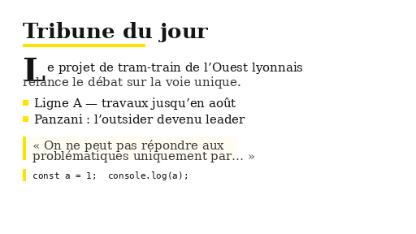

# tbdl — Obsidian theme

An editorial news-magazine theme for Obsidian. Serif body type (Merriweather), condensed sans headings (Oswald), a signature yellow accent, a fuchsia interactive accent, a drop-cap on the first paragraph (colored to match the surrounding text), styled lists, blockquotes, code, tables and callouts. Ships with the Google Material Icons font for use in notes, plus a dedicated dark palette.

## What's new

- **v2.0.3 — CSS-lint cleanup.** Dropped `text-underline-offset` from links (Obsidian's review lint flags the `text-decoration-*` longhand family as only partially supported). The `!important` on table header/cell colors stays: it's there specifically to beat an inline style Obsidian's own core table rendering applies (column resize/sort state), which selector specificity alone can't override — removing it would bring back the black-on-dark table header bug fixed in 2.0.1.
- **v2.0.2 — drop-cap actually renders now.** Reading view wraps every block in a `div.el-<tag>` (e.g. `div.el-p`), so the old `.markdown-preview-section > p:first-of-type` selector never matched — the drop-cap never appeared in a real vault, only in mockups. Fixed with a selector that finds the first paragraph wrapper regardless of preceding headings, and recolored it to follow the body text (black in light mode, near-white in dark) instead of a fixed fuchsia tint.
- **Fuchsia accent** (`#e5006f`): the interactive color — buttons, toggles, checked tasks, tags, H3 headings. Yellow stays the editorial/masthead accent (rules, dividers, H1/H2 bars).
- **Bullet dot** in Live Preview (edit mode) is now explicitly black in light mode (was inheriting the blue `--text-accent`), and fuchsia in dark mode for visibility.
- **Dark mode contrast pass**: fixed several elements that were unreadable or invisible in dark mode (italic text, blockquote text, text selection) and re-tuned the fuchsia tint used for on-background text so it keeps solid contrast against the dark palette.

## Features

- **Typography**: Merriweather for the body, Oswald for headings and the UI.
- **Editorial accents**: yellow (`#FFE200`) rules under H1, left bar on H2, fuchsia (`#e5006f`) H3, a drop-cap on the first paragraph (colored to match the body text).
- **Lists**: square yellow bullet markers (reading view), black/fuchsia bullet dot (Live Preview), Oswald blue ordered-list numerals.
- **Blockquotes**: yellow left bar on a soft cream background.
- **Code & tables**: styled code blocks, yellow header rows, themed frontmatter and callouts.
- **Material Icons**: the Google Material Icons font is loaded; use `<span class="material-icons">home</span>` in notes and callouts. Sizes (`.mi-sm`/`.mi-lg`/`.mi-xl`) and colors (`.mi-yellow`/`.mi-blue`/`.mi-fuchsia`/`.mi-muted`/`.mi-accent`) are provided.
- **Dark mode**: dedicated dark palette, tuned for reading comfort and contrast.
- **Editor gutter** colors via `--line-number-color` / `--gutter-background` (for the note's line-number gutter).

## Install

### From the community directory
1. Settings → Appearance → Themes → Manage → Browse community themes → search **tbdl** → install.
2. Select **tbdl** as the theme.

### Manually
Copy `manifest.json` and `theme.css` into `<vault>/.obsidian/themes/tbdl/`, then select the theme in Appearance.

## Showcase / screenshot



Two showcase notes highlight the theme's distinctive elements at a glance — headings (including the fuchsia H3), the drop-cap, a task list, an inline tag, a pull-quote, a callout, a table, code and Material Icons:

- [`showcase-light.md`](showcase-light.md) → source for `screenshot-light.png`
- [`showcase-dark.md`](showcase-dark.md) → source for `screenshot-dark.png`

To export the store screenshot, for each file:

1. Open the note in Obsidian, in Reading view.
2. Toggle Settings → Appearance → Base color scheme to match the note (**Light** for `showcase-light.md`, **Dark** for `showcase-dark.md`).
3. Resize the Obsidian window (or just the crop) to a **16:9** ratio.
4. Screenshot and crop/scale to exactly **512×288 px**.
5. Save as `screenshot-light.png` / `screenshot-dark.png`.

`screenshot.png` — the main preview above and the community catalog submission — is the two combined side by side: the left half of `screenshot-dark.png` and the right half of `screenshot-light.png`, each resized to 256×288 before stitching.

## Recommended companion: line numbers in code blocks

Obsidian does not number lines inside code blocks natively. To get **copy-safe line numbers** (numbers that are not included when you copy the code), install the **[Codeblock Customizer](https://github.com/mugiwara85/CodeblockCustomizer)** plugin and enable its **"Enable line numbers"** option. Its gutter is non-selectable, so copying code never includes the numbers.

Suggested gutter colors to match this theme (set them in Codeblock Customizer → Appearance & Styling):

| Color | Light | Dark |
|---|---|---|
| Gutter text | `#b9b9b0` | `#5f5f5a` |
| Gutter active line | `#1d3566` | `#ffd84d` |
| Gutter background | `#f7f7f4` | `#1b1f23` |

This theme works on its own without any plugin; Codeblock Customizer is only needed for line numbers in code blocks.

## Material Icons usage

```html
<span class="material-icons">home</span>
<span class="material-icons mi-yellow mi-lg">star</span>
<span class="material-icons mi-blue">push_pin</span>
```

Icon names come from the [Material Icons catalog](https://mui.com/material-ui/material-icons/). The font loads from Google Fonts (cached after first load).

## License

MIT © ledokter